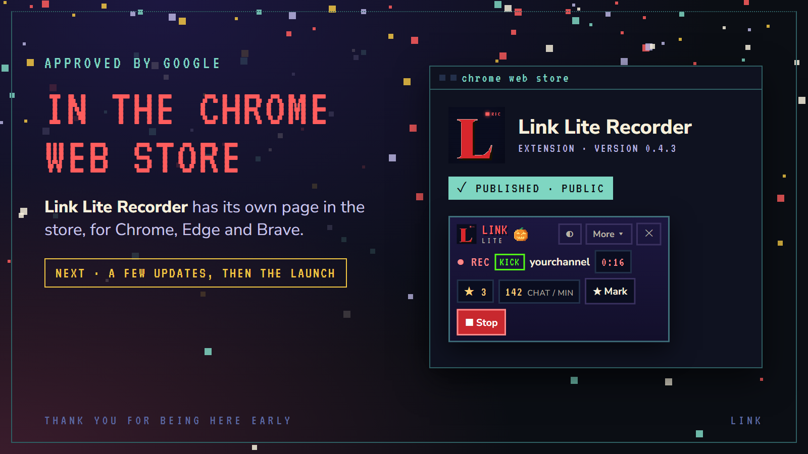
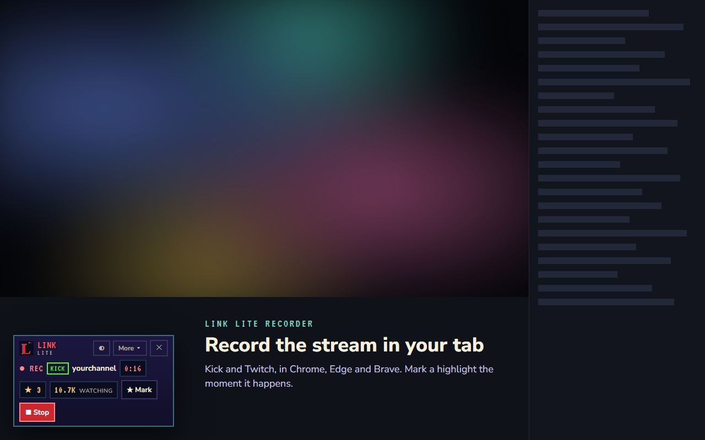
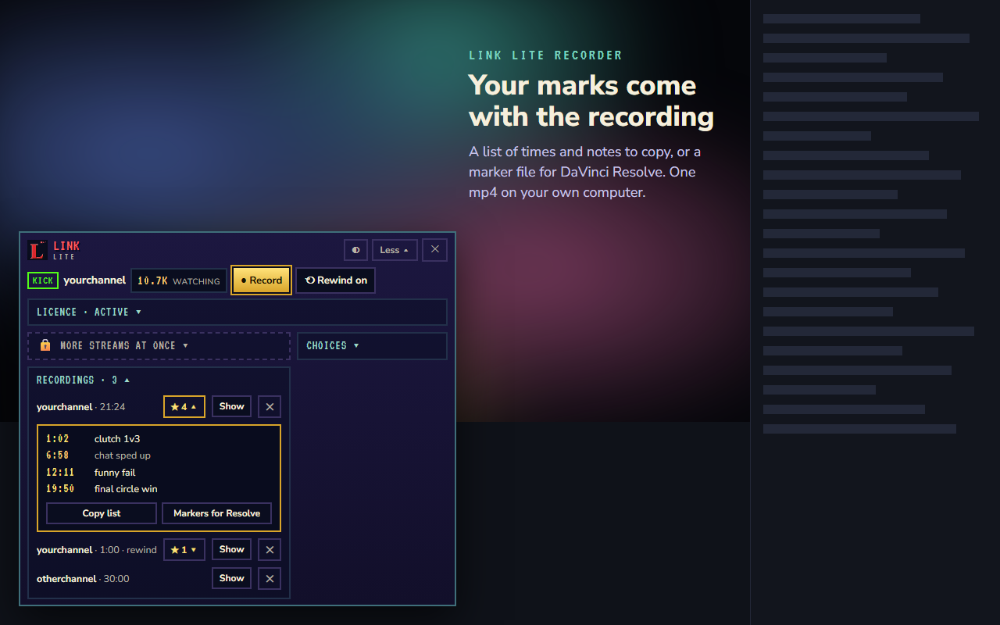
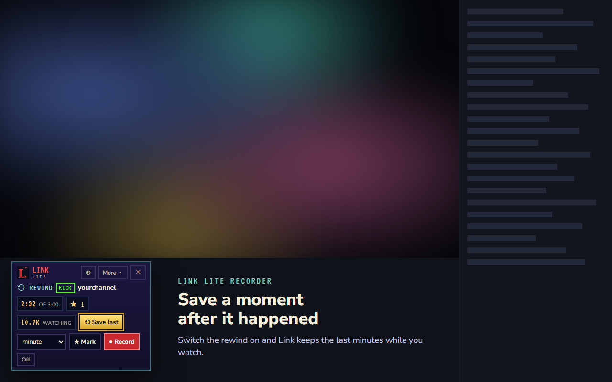
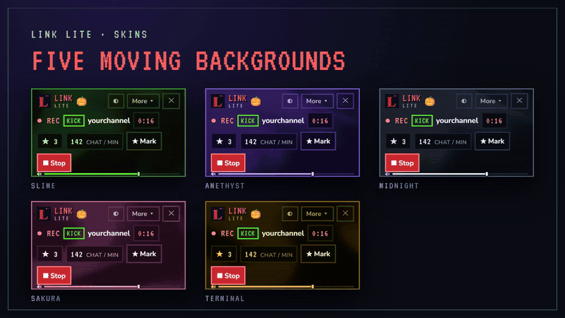
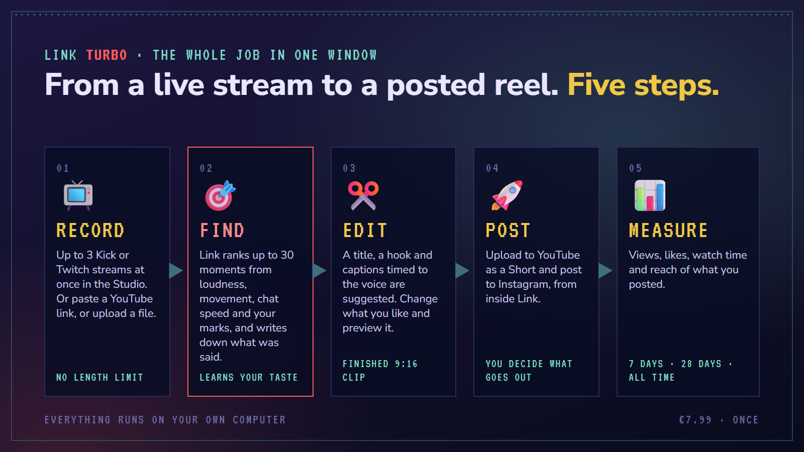

# Link

**From a live stream to a clip, on your own computer.**

[**Website**](https://linkturbo.app) &nbsp;·&nbsp; [**Add to Chrome**](https://chromewebstore.google.com/detail/link-lite-recorder/jjbnifoddmcjocjdmiaondcimkjmkjaa) &nbsp;·&nbsp; [**Discord**](https://discord.gg/N3jdn6WPJd) &nbsp;·&nbsp; [**How it works**](https://linkturbo.app/how-it-works) &nbsp;·&nbsp; [**Support**](https://linkturbo.app/support)

 

 

## Link Lite Recorder

A browser extension for **Chrome, Edge and Brave**. It records the Kick or Twitch stream playing in your tab, lets you mark the highlights as they happen, and saves one mp4 to your own computer.

| | |
|---|---|
| **● Record** | Picture and sound, cut out of the page. One mp4, up to 30 minutes. |
| **★ Mark** | A hotkey and a few words ("clutch 1v3"). Or by itself, when chat speeds up. |
| **⟲ Rewind** | Switched on, it keeps the last 3 minutes, so a moment can be saved after it happened. |
| **▣ For your editor** | The marks come with the recording: a list to copy, or a marker file for DaVinci Resolve. |
| **⌂ Stays on your computer** | Nothing is uploaded. No account, no analytics. Chat is only counted: never who wrote, or what. |

<table>
<tr>
<td></td>
<td></td>
</tr>
</table>

### Try it first

The first **3 recordings** work in full, with no key and no account. After that: **EUR 1.99, paid once**. No subscription. One key works in up to three browsers, and there is a 14-day money-back promise.

[**Add Link Lite Recorder to your browser →**](https://chromewebstore.google.com/detail/link-lite-recorder/jjbnifoddmcjocjdmiaondcimkjmkjaa)

 

## Skins for the panel

Five colour skins, each with a slow moving background of its own. Try any of them on before you buy. **EUR 0.99 each, paid once.** Classic stays free. They come with the next update.

 

## Link TURBO &nbsp;in development

The full program for Windows: record up to 3 streams at once, have the moments found for you, edit finished 9:16 clips, post them, and see how they did. **Link Night** records your streams while you are away and has the moments ranked when you are back. **EUR 7.99, paid once.** Not released yet.

 

## Join the community

News comes to Discord first: releases, updates, and what is being built next. Feedback there shapes what Link becomes.

### [discord.gg/N3jdn6WPJd](https://discord.gg/N3jdn6WPJd)

🎃 Members of the server by **2 November 2026** get **5% off Link TURBO** when it is released.

 

## Links

| | |
|---|---|
| Website | [linkturbo.app](https://linkturbo.app) |
| Chrome Web Store | [Link Lite Recorder](https://chromewebstore.google.com/detail/link-lite-recorder/jjbnifoddmcjocjdmiaondcimkjmkjaa) |
| Discord | [discord.gg/N3jdn6WPJd](https://discord.gg/N3jdn6WPJd) |
| The guide | [linkturbo.app/how-it-works](https://linkturbo.app/how-it-works) |
| Buying and the licence key | [linkturbo.app/buy](https://linkturbo.app/buy) |
| What's new | [linkturbo.app/changelog](https://linkturbo.app/changelog) |
| Support | [support@linkturbo.app](mailto:support@linkturbo.app) |
| Privacy · Terms · Copyright | [privacy](https://linkturbo.app/privacy) · [terms](https://linkturbo.app/terms) · [copyright](https://linkturbo.app/copyright) |

## About this repository

This repository holds the published pages of [linkturbo.app](https://linkturbo.app), served by GitHub Pages. The extension and the program are not open source; their code is not here.

Link is a tool. Record your own streams, or streams whose owner allows it. Not affiliated with Kick or Twitch.
